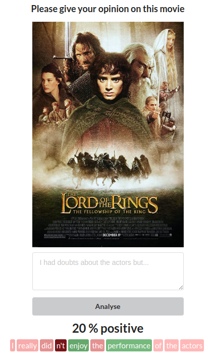

<h1 align="center">Sentiment Attributor Web App</h1>
<p align="center"></p>

## To-do
- [x] Docker
- [ ] AWS: Elastic Beanstalk
- [ ] CI/CD: GitHub Actions

## Backend
RESTful API made with Django that serves a PyTorch model at http://localhost:8000/api/predict. Given an input sentence, it predicts the probability the sentiment is positive. In addition, it gives attributions for how much each token affects the sentiment. It uses [Captum's](https://captum.ai/docs/algorithms#integrated-gradients) implementation of integrated gradients[<sup>[1]</sup>](https://arxiv.org/abs/1703.01365).

Main functionality is in [backend/PredictionApp/views.py](https://github.com/Anntey/sentiment-attributor-webapp/blob/master/backend/PredictionApp/views.py) and [backend/PredictionApp/apps.py](https://github.com/Anntey/sentiment-attributor-webapp/blob/master/backend/PredictionApp/apps.py). A notebook related to prototyping is in [backend/PredictionApp/training/train.ipynb](https://github.com/Anntey/sentiment-attributor-webapp/blob/master/backend/PredictionApp/training/train.ipynb)

```zsh
$ python manage.py runserver
```

## Frontend
A minimal React frontend at http://localhost:3000 that makes POST requests to the backend when the text form is submitted. The poster of a random movie is given as inspiration. The predicted probability is rendered and words in the original sentence are colored red-green by their corresponding attributions.

```zsh
$ npm start
```
